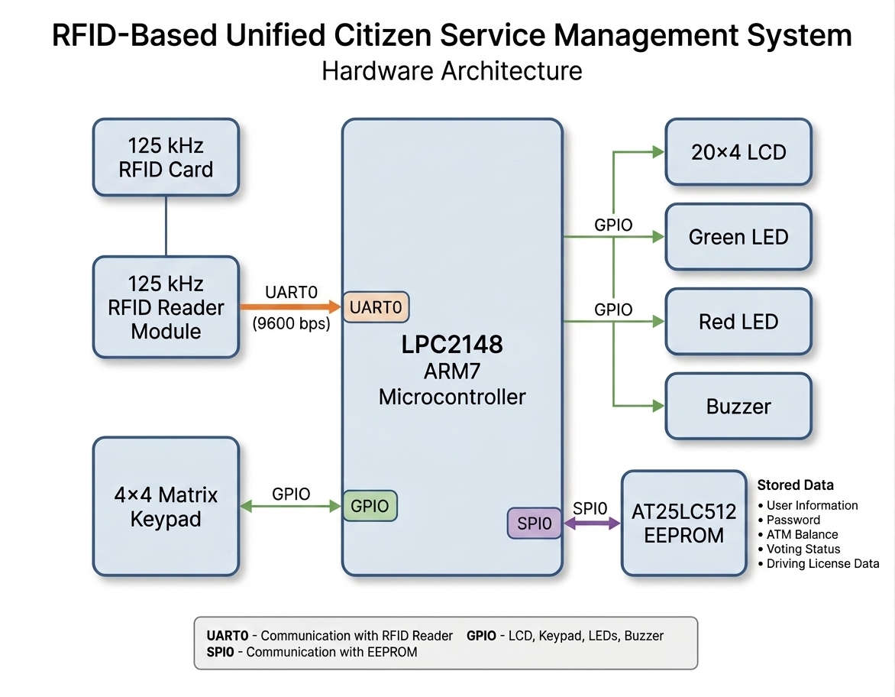
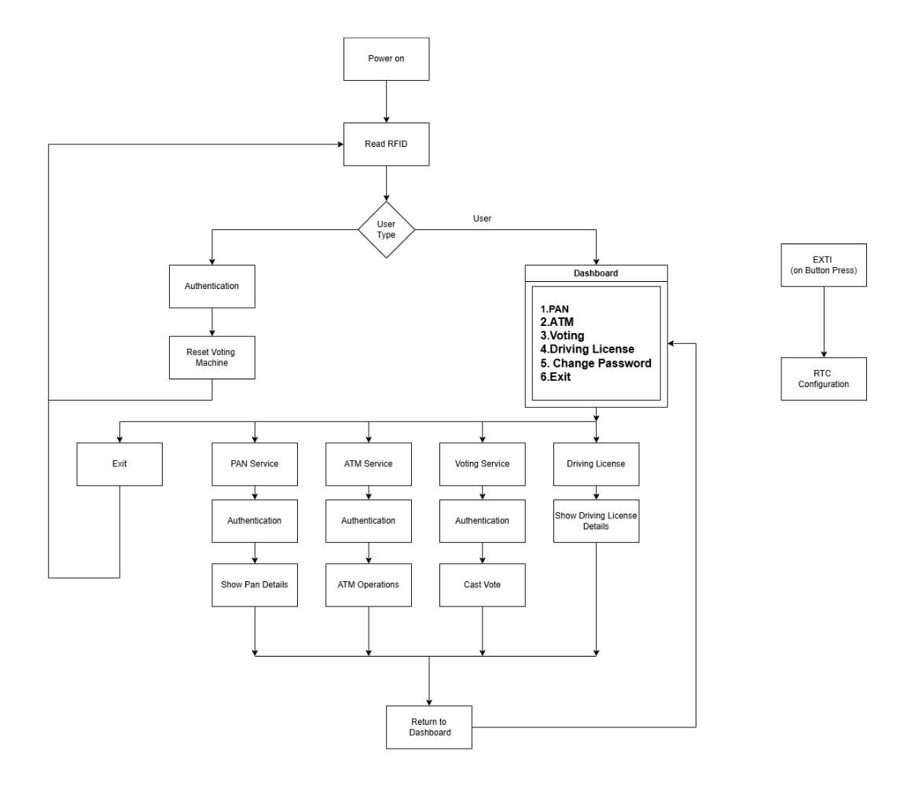
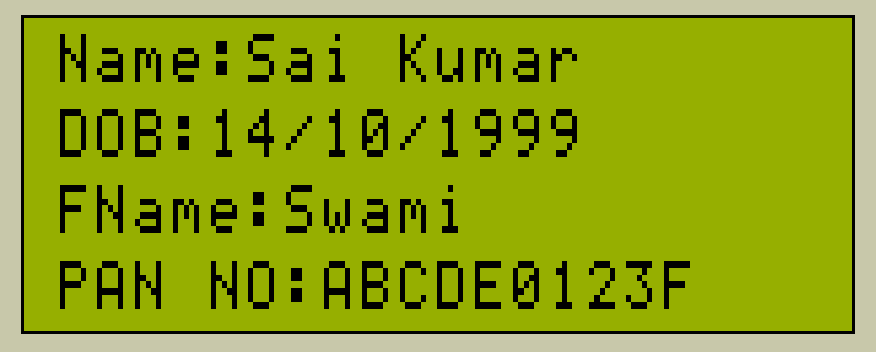
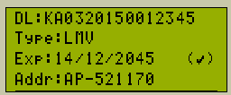

# RFID-Based Unified Citizen Service Management System

> A multi-service embedded platform built on the **LPC2148 (ARM7TDMI-S)** microcontroller that integrates multiple citizen-centric services such as PAN information, ATM operations, Digital Voting, and Driving License verification using a single RFID card.


---

# 🎯 Project Objective

Citizens today carry multiple physical cards for different public services such as ATM banking, PAN identification, Driving License verification, and Voting. Each service typically requires its own dedicated card, making identity management less convenient.

This project explores the concept of a **Unified Citizen Service Card**, where a single RFID card can serve as a common digital identity for accessing multiple services through a unified embedded platform.

Instead of developing separate embedded systems for each individual application, this project demonstrates the feasibility of integrating multiple citizen services into a single menu-driven embedded platform.

The objective is not to replace existing government infrastructure, but to demonstrate how a unified identity card could simplify access to multiple services through a single secure authentication mechanism.

---

# 📖 Project Overview

The RFID-Based Unified Citizen Service Management System is an Embedded C application developed on the NXP LPC2148 ARM7TDMI-S microcontroller.

The prototype demonstrates how a single RFID card can be used to authenticate users and provide access to multiple citizen-centric services through one embedded platform.

After successful RFID authentication, users are presented with a dashboard from which they can access services such as:

- PAN Information
- ATM Operations
- Digital Voting
- Driving License Details

Sensitive operations are protected through password authentication, while user information is stored persistently in an external SPI EEPROM.

The application follows a modular firmware architecture, integrating UART, SPI, RTC, LCD, Matrix Keypad, LEDs, and Buzzer to simulate a complete embedded service management system.

---

# 🚀 Implemented Services

| Feature | Description |
|----------|-------------|
| 🔐 RFID Authentication | Secure user identification using RFID cards |
| 👤 User & Officer Modes | Separate access levels for users and administrators |
| 🪪 PAN Service | Displays stored PAN card details |
| 🏧 ATM Services | Balance enquiry, deposit and withdrawal operations |
| 🗳 Digital Voting | Secure one-time voting functionality |
| 🚗 Driving License | Displays driving license information |
| 🔑 Password Authentication | Protects sensitive services |
| 💾 SPI EEPROM Storage | Persistent storage of user credentials and data |
| ⏰ RTC Support | Date and time management for the system |

---

# 🏗 Hardware Architecture

The following block diagram illustrates the hardware architecture of the system. The LPC2148 ARM7 microcontroller acts as the central controller and interfaces with all external peripherals.

<p align="center">
    
</p>

---

# 🔄 Software Flowchart

The firmware is implemented as a state-driven embedded application. The flowchart below illustrates the complete execution flow from RFID card detection to service execution.

<p align="center">
    
</p>

---

# 🛠 Hardware Components

- LPC2148 ARM7 Development Board
- 125 KHz RFID Reader Module
- RFID Cards
- 20×4 Character LCD
- 4×4 Matrix Keypad
- SPI EEPROM (25LC512)
- RTC
- LEDs
- Buzzer

---

# 💻 Software & Development Tools

### Programming Language

- Embedded C

### IDE

- Keil µVision

### Flashing Tool

- Flash Magic

### Version Control

- Git
- GitHub

### Communication Protocols

- UART
- SPI

---

# 📂 Repository Structure

```text
RFID-Unified-Citizen-Service-Management-System/
│
├── App/
├── Drivers/
├── Includes/
├── Service/
├── images/
│   ├── hardware_architecture.png
│   ├── flowchart.png
│   ├── dashboard.png
│   ├── pan.png
│   ├── atm_services.png
│   ├── voting.png
│   └── driving_license.png
│
└── README.md
```

---

# 📸 LCD Demonstration

The following screenshots demonstrate different modules implemented in the project.

| Dashboard | PAN Service |
|-----------|-------------|
|  |  |

| ATM Service | Voting Service |
|-------------|----------------|
|  |  |

| Driving License |
|-----------------|
|  |

> **Note:** The screenshots above represent the primary user interface of each module. Additional interactions such as ATM transactions (Balance Enquiry, Deposit, Withdrawal), password verification, and voting operations are performed through subsequent LCD screens during execution.

---

# ⚙ How It Works

1. Power on the LPC2148 development board.
2. Scan an RFID card using the RFID reader.
3. The firmware identifies the card type.
4. Officer cards enter administrative mode.
5. User cards open the service dashboard.
6. Select the required service using the keypad.
7. Password authentication is performed where required.
8. User information is read from or updated to the SPI EEPROM.
9. Results are displayed on the LCD.
10. After completing the operation, the system returns to the dashboard.

---

# 🚀 Build & Flash

### Requirements

- Keil µVision
- Flash Magic
- LPC2148 Development Board

### Steps

1. Clone this repository.

```bash
git clone https://github.com/Cherry6547/RFID-Unified-Citizen-Service-Management-System.git
```

2. Open the project in **Keil µVision**.

3. Build the project.

4. Connect the LPC2148 board.

5. Flash the generated HEX file using **Flash Magic**.

6. Reset the board and start using the application.

---

# 🔮 Future Enhancements

- Secure password encryption
- Fingerprint/Biometric authentication
- Cloud-based citizen database
- GSM/Wi-Fi connectivity
- Touchscreen user interface
- Secure bootloader support
- Remote firmware updates

---

# 👨‍💻 Author

**Charan Sai Mathkala**

Embedded Systems | Embedded C | ARM7 | Linux System Programming | TCP/IP

GitHub: **https://github.com/Cherry6547**

---

## ⭐ If you found this project useful, consider giving it a star!